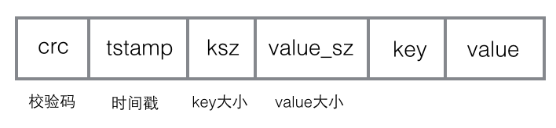

# 第2章 单机存储系统

*单机存储引擎就是哈希表、B树等数据结构在机械磁盘、SSD等持久化介质上的实现。单机存储系统就是单机存储引擎的一种封装，对外提供文件、键值、表格或者关系模型。
单机存储系统的理论来源于关系数据库。数据库将一个或多个操作组成一组，称作事务，事务具有ACID特性。*

## 2.1 硬件基础

*摩尔定律：每18个月计算机等IT产品的性能会翻一番；或者说相同性能的计算机等IT产品，每18个月价钱会降一半。*

### 2.1.1 CPU架构

从单核单个到多核多个；SMP架构到NUMA架构。

### 2.1.2 IO总线

存储系统的性能瓶颈一般在于IO。

### 2.1.3 网络拓扑

传统的数据中心网络拓扑。三层：接入层（Edge）、汇聚层（Aggregation）、核心层（Core）。

Google于2018年提出扁平化拓扑结构，即三级CLOS网络。

### 2.1.4 性能参数

SSD盘、SAS盘、SATA盘差异。

### 2.1.5 存储层次架构

存储系统的性能主要包括两个维度：吞吐量以及访问延时。保证访问延时的基础上，通过最低成本实现尽可能高的吞吐量。

热数据存储到SSD中，冷数据存储到磁盘中。

## 2.2 单机存储系统

*哈希存储引擎（增、删、改、随机读，不支持顺序扫描）、B树存储引擎（增、删、读、改，支持顺序扫描）、LSM树存储引擎（增、删、读、改，支持顺序扫描）。*

### 2.2.1 哈希存储引擎

*Bitcask是一个基于哈希表结构的键值存储系统，它仅支持追加操作，即所有的写操作只追加而不修改老的数据。该系统中，每个文件有一定的大小限制，当文件达到相应的大小时，就会产生一个新的文件，老的文件只读不写。任意时刻，只有一个文件是可写的，用于数据追加，称为活跃文件。*

1. 数据结构

如图所示Bitcask数据文件是一条一条写入的写入操作，每一条记录的数据项分别为主键（key）、value内容（value）、主键长度（key_sz）、value长度（value_sz）、时间戳（timestamp）以及crc校验值。

哈希表结构中每一项包含了三个用于定位数据的信息，分别是文件编号（file_id），value在文件中的位置（value_pos），value长度（value_sz）。

通过读取file_id对应文件的value_pos开始的value_sz个字节，就得到了最终的value值。

写入文件时首先将Key-Value记录追加到活跃数据文件的末尾，接着更新内存哈希表。因此，每个写操作总共需要进行一次顺序的磁盘写入和一次内存操作。

2. 定期合并

Bitcask系统中的记录删除或更新后，原来的记录成为垃圾数据。如果这些数据一直保存下去，文件会无限膨胀下去，为了解决这个问题，Bitcask需要定期执行合并操作实现垃圾回收。

所谓合并操作，即将所有老数据文件中的数据扫描一遍并生成新的数据文件，这里的合并其实就是对同一个key的多个操作以只保留最新一个的原则进行删除，每次合并后，新生成的数据文件就不再有冗余数据了。

3. 快速恢复

Bitcask系统中的哈希索引存储在内存中，如果不做额外的工作，服务器断电重启重建哈希表需要扫描一遍数据文件，如果数据文件很大，这是一个非常耗时的过程。Bitcask通过索引文件来提高重建哈希表的速度。

索引文件就是将内存中的哈希索引表转储到磁盘上生成的结果文件。Bitcask对老数据文件进行合并操作时，会产生新的数据文件，这个过程中还会产生一个索引文件，这个索引文件记录每一条记录的哈希索引信息。

### 2.2.2 B树存储引擎

*相比哈希存储引擎，B树存储引擎不仅支持随机读取，还支持范围扫描。关系数据库中通过索引访问数据，例如MySQL InnoDB，行的数据存于聚集索引中，组织成B+树（B树的一种）数据结构。*

1. 数据结构

B+树的根节点是常驻内存的，B+树一次检索最多需要h-1次磁盘IO，复杂度为
。

2. 缓冲区管理

缓冲区管理器负责将可用的内存划分成缓冲区，缓冲区是与页面同等大小的区域，磁盘块的内容可以传送到缓冲区中。缓冲区管理器的关键在于替换策略，即选择将哪些页面淘汰出缓冲池。

(1) LRU

LRU算法淘汰最长时间没有读过或者写过的块。这种方法要求缓冲区管理器按照页面最后一次被访问的时间组成一个链表，每次淘汰链表尾部的页面。

(2) LIRS

LRU算法在大多数情况下表现是不错的，但存在一个问题：假如某一个查询做了一次全表扫描，将导致缓冲池中大量页面（可能包含很多很快被访问的热点页面）被替换，从而污染缓冲池。

现代数据库一般采用LIRS算法，将缓冲池分为两级，数据首先进入第一级，如果数据在较短时间被访问两次或者以上，则成为热点数据进入第二级，每一级内部还是采用LRU替换算法。

### 2.2.3 LSM树存储引擎

*LSM树（Log Structured Merge Tree）思想：将对数据的修改增量保持在内存中，达到制定的大小限制后将这些修改操作批量写入磁盘，读取时需要合并磁盘中的历史数据和内存中最近的修改操作。*

*LSM树的优势在于有效地规避了磁盘随机写入问题，但读取时可能需要访问较多的磁盘文件。*

*这里以LevelDB为例子介绍LSM树*

1. 存储结构

LevelDB存储引擎主要包括：内存中的MemTable和不可变MemTable以及磁盘上的几种主要文件：当前文件、清单文件、操作日志文件以及SSTable文件。

当应用写入一条记录时，LevelDB会首先将修改操作写入到操作日志，成功后再将修改操作应用到MemTable。

当MemTable占用的内存达到一个上限值，需要将内存的数据转储到外存文件中（LevelDB会将原来的MemTable冻结成不可变MemTable，并生成一个新的MemTable）。

LevelDB后台线程会将不可变MemTable的数据排序后转储到磁盘，形成一个新的SSTable文件，操作成为Compaction。SSTable文件是内存中的数据不断进行Compaction操作后形成的，且SSTable的所有文件是一种层级结构，第0层为Level0，第一层为Level1，以此类推。

2. 合并

LevelDB写入操作很简单，但读取操作比较复杂，需要在内存以及各级文件中按照从新到老依次查找，代价很高。为了加快速度，LevelDB内部会执行Compaction操作来对已有的记录进行压缩整理，从而删除一些不再有效的记录，减少数据规模和文件数量。

LevelDB的两种Compaction操作：minor compaction和major compaction。
