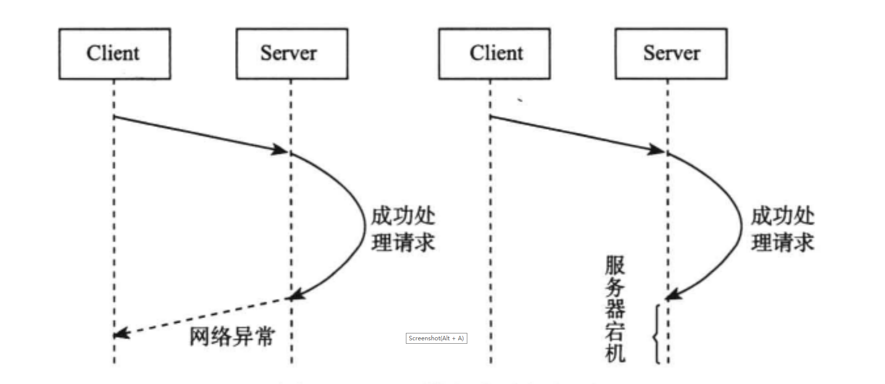
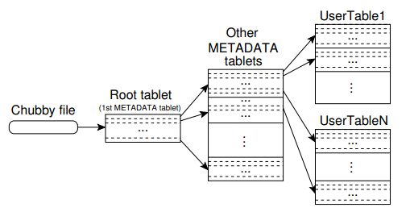
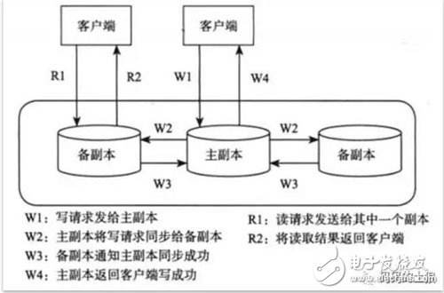

# 第3章 分布式系统

*分布式系统涉及数据分布、复制、一致性、容错及分布式协议。*

## 3.1 基本概念

### 3.1.1 异常

*大规模分布式存储系统的一个核心问题在于自动容错。然而，服务器节点是不可靠的，网络也是不可靠的。*

1. 异常类型

(1) 服务器宕机

引发服务器宕机的原因可能是内存错误、服务器停电。

服务器重启节点后，节点将失去所有的内存信息。因此，设计存储系统时需要考虑如何通过读取持久化介质（如机械硬盘，固态硬盘）中的数据来恢复内存信息，从而恢复到宕机前的某个一致的状态。

(2) 网络异常

引发网络异常的原因可能是消息丢失、消息乱序（如采用UDP通信）或者网络包数据错误。考虑“网络分区”是一种特殊的异常。

设计容错系统的一个基本原则是：网络永远是不可靠的，任何一个消息只有收到对方的回复后才可认为发送成功，系统设计时总是假设网络将会出现异常并采用相应的处理措施。

(3) 磁盘故障

磁盘故障分为两种情况：磁盘损坏和磁盘数据错误。磁盘损坏时，将会丢失存储在上面的数据，，因而，分布式存储系统需要考虑将数据存储到多台服务器，即使其中一台服务器磁盘出现故障，也能从其他服务器上恢复数据。对于磁盘数据错误，往往可以采用校验和（checksum）机制解决，这样的机制既可以在操作系统层面实现，又可以在上层的分布式存储系统层面实现。

2. “超时”

由于网络异常的存在，分布式存储系统中请求结果存在“三态”的概念。如果某个节点向另一个节点发起RPC，这个RPC执行的结果有三种状态：“成功”、“失败”、“超时”（未知状态），也称为分布式存储系统的三态。

一个通俗的例子：ATM取款时ATM机有时会提示：“无法打印凭条，是否继续取款？”。这是因为ATM机和银行服务器端通信，二者之间的网络可能出现故障，此时ATM机发往银行服务器端的RPC请求如果发生超时，ATM机无法确定RPC请求成功还是失败。正常情况下，ATM机会打印凭条，用于后续和银行服务器端对账。

当出现超时状态时，只能通过不断读取之前操作的状态来验证RPC操作是否成功。当然，设计分布式存储系统时可以将操作设计为“幂等”的，也就是说，操作执行一次与执行多次的结果相同，例如，覆盖写就是一种常见的幂等操作。如果采用这种设计，当出现失败和超时时，都可以采用相同的处理方式，即一直重试直到成功。

### 3.1.2 一致性

由于异常的存在，分布式存储系统设计时往往将数据冗余存储多份，当一个节点故障时，可以从其他副本读到数据。副本是分布式存储系统容错技术的唯一手段。由于多个副本的存在，如何保证副本之间的一致性是整个分布式系统的理论核心。

可以从两个角度理解一致性：第一个角度是用户，或者说是客户端，即客户端读写操作是否符合某种特性；第二个角度是存储系统，即存储系统的多个副本之间是否一致，更新的顺序是否相同，等等。

场景：

* 存储系统：存储系统理解为一个黑盒子，可提供可用性和持久性的保证。
* 客户端A：客户端A主要实现从存储系统write和read操作。
* 客户端B和客户端C：客户端B和C独立于A，并且B和C也是相互独立的，它们同时也实现对存储系统的write和read操作。

从客户端角度看，一致性包含如下三种情况：

**强一致性：** 假如A先写入了一个值到存储系统，存储系统保证后续A、B、C的读取操作都将返回最新值。

**弱一致性：** 假如A先写入了一个值到存储系统，存储系统不能保证后续A、B、C的读取操作是否能够读取到最新值。

**最终一致性：** 最终一致性是弱一致性的特例。假如A首先写入一个值到存储系统，存储系统保证如果后续没有写操作更新同样的值，A、B、C的读取操作最终都会读取A写入的最新值。最终一致性有一个不一致窗口的概念，它特质从A写入值，到最后A、B、C读取到最新值的这段时间。不一致窗口的大小依赖于以下几个因素：交互延迟、系统的负载，以及复制协议要求同步的副本数。

最终一致性描述比较粗略，其他常见的变体如下：

**读写（read-your-writes）一致性：** 如果客户端A写入了最新的值，那么A的后续操作都会读到最新值。但是其他用户（比如B或者C）可以要过一会儿才能看到。

**会话（session）一致性：** 要求客户端和存储系统交互的整个会话期间保证读写一致性。如果原有会话因为某种原因实效而创建新的会话，原有会话和新会话之间的操作不保证读写一致性。

**单调读（monotonic read）一致性：** 如果客户端A已经读到了对象的某个值，那么后续操作将不会读取到更早的值。

**单调写（monotonic write）一致性：** 客户端A的写操作按顺序完成，这就意味着，对于同一个客户端的操作，存储系统的多个副本需要按照与客户端相同的顺序完成。

从存储系统的角度看，一致性主要包括以下几个方面：

**副本一致性：** 存储系统的多个副本之间的数据是否一致，不一致的时间窗口等。

**更新顺序一致性：** 存储系统的多个副本之间是否按照相同的顺序执行更新操作。

一般来说，存储系统可以支持强一致性，也可以为了性能考虑最终一致性。

### 3.1.3 衡量指标

（1） 性能

常见的性能指标有:系统的吞吐能力以及系统的响应时间。其中，系统的吞吐能力指系统在某一时间可以处理的请求总数，通常用每秒处理的读操作数（QPS，Query Per Second）或者写操作数（TPS，Transaction Per Second）来衡量；系统的相应延迟，指从某个请求发出到接收到返回结果消耗的时间，通常用平均延时或者99.9%以上请求的最大延时来衡量。这两个指标往往是矛盾的，追求高吞吐量的系统，往往很难做到低延迟；追求低延迟的系统，吞吐量也会受到限制。因此，设计系统时需要权衡这两个指标。

（2） 可用性

系统的可用性（availability）是指系统在面对各种异常时可以提供正常服务的能力。系统的可用性可以用系统停服务的时间与正常服务的时间的比例来衡量。

（3） 一致性

3.1.2节说明了系统的一致性。一般来说，越是强的一致性模型，用户使用起来越简单。

>笔者认为，如果系统部署在一个数据中心，只要系统设计合理，在保证强一致性的前提下，不会对性能和可用性造成太大影响。后文中笔者在Alibaba参与开发的OceanBase系统以及Google的分布式存储系统都倾向强一致性。

（4） 可扩展性

系统的可扩展性指分布式存储系统通过扩展集群服务器规模来提高系统存储容量、计算量和性能的能力。

随着业务的发展，对底层存储系统的性能需求不断增加，比较好的方式就是通过自动增加服务器提高系统的能力。理想的分布式存储系统实现了“线性可扩展”，也就是说，随着集群规模的增加，系统的整体性能与服务器数量呈线性关系。

## 3.2 性能分析

*性能分析就是需要找出可能出现的资源瓶颈。*

**1. 生成一张有30张缩略图（假设图片原始大小256KB）的页面需要多长时间？**

**方案1：** 顺序操作，每次先从磁盘中读取图片，再执行生成缩略图操作，执行时间为：30*10ms（磁盘随机读取时间）+30*256K/30MB/s（假设缩略图生成速度为30MB/s）=560ms

**方案2：** 并行操作，一次性发送30个请求，每个请求读取一张图片并生成缩略图，执行时间为：10ms+256K/300MB/s=18ms

这里其他因素暂不考虑。

**2. 1GB的4字节整数，执行一次快速排序需要多少时间？**

Google的Jeff Dean提出了一种排序性能分析方法：排序时间=比较时间（分支预测错误）+内存访问时间。快速排序过程中会发生大量的分支预测错误，比较次数为2^28×log(2^28)=2^33，其中，约1/2的比较会发生分支预测错误，所以比较时间为1/2*2^33*5ns=21s，另外，快速排序每次分割操作都需要扫描一遍内存，假设内存顺序访问性能为4GB/s，所以内存访问时间为28×1GB/4GB=7s。因此，单线程排序1GB4字节整数总时间约为28s。

**3. Bigtable系统性能分析**

Bigtable是Google的分布式表格系统，它的优势是可扩展性好，可随时增加或者减少集群中的服务器，但支持的功能有限，支持的操作主要包括：

* 单行操作：基于主键的随机读取，插入，更新，删除（CRUD）操作；
* 多行扫描：扫描一段主键范围内的数据。Bigtable中每行包括多个列，每一行的某一列对应一个数据单元，每个数据单元包括多个版本，可以按照列名或者版本对扫描结果进行过滤。

>Bigtable系统总体设计性能指标样例

## 3.3 数据分布

*分布式系统数据分布的方式主要有两种，一种是哈希分布，如一致性哈希，代表系统为Amazon的Dynamo系统；另一种方法是顺序分布，即每张表格上的数据按照主键整体有序，代表系统为Google的Bigtable系统。*

### 3.3.1 哈希分布

如果哈希函数的散列特性很好，哈希方式可以将数据比较均匀地分布到集群中去。但是，找到一个散列特性非常好的哈希函数非常难。

传统哈希分布算法还有一个问题：当服务器上线或下线时，N值发生变化，数据映射完全被打乱，几乎所有的数据都需要重新分布，这将带来大量的数据迁移。

**一种思路** 不再简单地将哈希值和服务器个数做除法取模映射，而是将哈希值与服务器的关系作为元数据，交给专门的元数据服务器来管理。访问数据时，首先计算哈希值，再查询元数据服务器，获得哈希值对应的服务器。这样，集群扩容时，可以将部分哈希值分配给新加入的机器并迁移对应的数据。

**另一种思路** 一致性哈希（Distributed Hash table,DHT）算法。算法思路：给系统中每个节点分配一个随机token，这些token构成一个哈希环。执行数据存放操作时，先计算Key（主键）的哈希值，然后存放到顺时针方向第一个大于或者等于该哈希值的token所在的节点。一致性哈希的优点在于节点加入、删除时只会影响到在哈希环中相邻的节点，而对其他节点没影响。

### 3.3.2 顺序分布

哈希散列破坏了数据的有序性,只支持随机读取操作，不能够支持顺序扫描。

顺序分布在分布式表格系统中比较常见，一般的做法是将大表顺序划分为连续的范围，每个范围成为一个子表，总控服务器负责将这些子表按照一定的策略分配到存储节点上。

为了支持更大的集群规模，Bigtable这样的系统将索引分为两级：根表以及元数据表（Meta表）。其结构和B+树数据结构相似。

### 3.3.3 负载均衡

分布式存储系统的每个集群中一般有一个总控节点，其他节点为工作节点，由总控节点根据全局负载信息进行整体调度。工作节点刚上线时，总控节点需要将数据迁移到该节点，另外，系统运行过程中也需要不断地执行迁移任务，将数据从负载较高的工作节点迁移到负载较低的工作节点。

工作节点通过心跳包（Heartbeat，定时发送）将节点负载相关信息，如CPU、内存、磁盘、网络等资源使用率，读写次数及读写数据量等发送给主控节点。主控节点计算出工作节点的负载以及需要迁移的数据，生成迁移任务放入迁移队列中等待执行。

需要注意的是，负载均衡操作需要控制节奏，比如一台全新的工作节点刚上线的时候，由于负载最低，如果主控节点将大量的数据同时迁移到这台新加入的机器，整个系统在新增机器的过程中服务能力会大幅下降。负载均衡操作需要做到比较平滑，一般来说，从新机器加入到集群负载达到比较均衡的状态需要较长一段时间，比如30分钟到一个小时。

负载均衡需要执行数据迁移操作。在分布式存储系统中往往会存储数据的多个副本，其中一个副本为主副本，其他副本为备副本，由主副本对外提供服务。迁移备副本不会对服务造成影响，迁移主副本也可以首先将数据的读写服务切换到其他备副本。整个迁移过程可以做到无缝，对用户完全透明。

## 3.4 复制

*分布式存储系统通过复制协议将数据同步到多个存储节点，并确保多个副本之间的数据一致性。*

*同一份数据的多个副本中往往有一个副本为主副本（Primary），其他副本为备副本（Backup），由主副本将数据复制到备份副本。复制协议分为两种，强同步复制以及异步复制，二者的区别在于用户的写请求是否需要同步到备副本才可以返回成功。假如备份副本不止一个，复制协议还会要求至少需要同步到几个备副本。当主副本出现故障时，分布式存储系统能够将服务自动切换到某个备副本，实现自动容错。*

*一致性和可用性是矛盾的，强同步复制协议可以保证主备副本之间的一致性，但是当备副本出现故障时，也可能阻塞存储系统的正常写服务，系统的整体可用性受到影响；异步复制协议的可用性相对较好，但一致性得不到保障，主副本出现故障时还有数据丢失的可能。*

### 3.4.1 复制的概述

分布式存储系统中数据保存多个副本，一般来说，其中一个副本为主副本，其他副本为备副本，常见的做法是数据写入到主副本，由主副本确定操作的顺序并复制到其他副本。

客户端将写请求发送给主副本，主副本将写请求复制到其他备副本，常见的做法是同步操作日志（Commit Log）。主副本首先将操作日志同步到备副本，备副本回放操作日志，完成后通知主副本。接着，主副本修改本机，等到所有的操作都完成后再通知客户端写成功。下图中的复制协议要求主备同步成功才可以返回客户端写成功，这种协议称为强同步协议。强同步协议提供了强一致性，但是，如果备副本出现问题将阻塞写操作，系统可用性较差。

假设所有副本个数为N，且N>2，即备副本个数大于1,。那么，实现强同步协议时，主副本可以将操作日志并发地发给所有备副本并等待回复，至少有一个备副本返回成功就可以回复客户端操作成功。强同步的好处在于如果出现主副本故障，至少有一个备副本拥有完整的数据，分布式存储系统可以自动地将服务切换到最新的备副本而不用担心数据丢失的情况。

与强同步对应的复制方式是异步复制。在异步模式下，主副本不需要等待备副本的回应，只需要本地修改成功就可以告知客户端写操作成功。异步复制的好处在于系统可用性较好，但一致性较差，如果主副本发生不可恢复故障，可能丢失最后一部分更新操作。

强同步复制和异步复制都是将主副本的数据以某种形式发送到其他副本，这种复制协议称为给予主副本的复制协议（Primary-based protocol）。这种方法要求任何时刻只能有一个副本为主副本，由他来确定写操作之间的顺序。如果主副本出现故障，需要选举一个备副本称为新的主副本，这步操作称为选举，经典的选举协议如Paxos协议。

主备副本之间的复制一般通过操作日志来实现。操作日志的原理：为了利用好磁盘的顺序读写特性，将客户端的写操作先顺序写入到磁盘中，然后应用到内存中，由于内存是随机读写设备，可以很容易通过各种数据结构，如B+树将数据有效地组织起来。当服务器宕机重启时，只需要回放操作日志就可以恢复内存状态。为了提高系统的并发能力，系统会积攒一定的操作日志再批量写入到磁盘中，这种技术一般称为成组提交。

如果每次服务器出现故障都需要回放所有操作日志，效率是无法忍受的，检查点（checkpoint）正是为了解决这个问题。系统定期将内存状态以检查点文件的形式dump到磁盘中，并记录检查点时刻对应的操作日志回放点。检查点文件成功创建后，回放点之前的日志可以被垃圾回收，以后如果服务器出现故障，只需要回放检查点之后的操作日志。

除了基于主副本的复制协议，分布式存储系统中还可能使用基于多个存储节点的复制协议（Replicated-write protocol）。比如Dynamo系统中的NWR复制协议，其中，N为副本数量，W为写操作的副本数，R为读操作的副本数。NWR协议中多个副本不再区分主和备，客户端根据一定的策略往其中W个副本写入数据，读取其中的R个副本。只要W+R>N，可以保证读到的副本中至少有一个包含了最新的更新。然而，这种协议的问题在于不同副本的操作顺序可能不一致，从多个副本读取时可能出现冲突。这种方式在实际系统中比较少见，不建议使用。

### 3.4.2 一致性与可用性

CAP理论：一致性（Consistency），可用性（Availability）以及分区容忍性（tolerance of network Partition）三者不能同时满足。CAP可以如下理解：

* 一致性：读操作总是能读取到之前完成的写操作结果，满足这个条件的系统称为强一致性，这里的“之前”一般对同一个客户端而言；
* 可用性：读写操作在单台机器发生故障的情况下任然能够正常执行，而不需要等待发生故障的机器重启或者其上的服务迁移到其他机器；
* 分区容忍性：机器故障、网络故障、机房停电等异常情况下任然能能够满足一致性和可用性。

分布式存储系统要求能够自动容错，也就是说，分区容忍性总是需要满足的，因此，一致性和写操作的可用性不能同时满足。

如果采用强同步复制，保证了存储系统的一致性，然而，当主备副本之间出现网络或其他故障时，写操作将被阻塞，系统的可用性无法得到满足。如果采用异步复制，保证了存储系统的可用性，但无法做到强一致性。

存储系统设计需要在一致性和可用性之间权衡，在某些场景下，不允许丢失数据，在另外一些场景下，极小的概率丢失部分数据是允许的，可用性更加重要。例如，Oracle数据库的DataGuard复制组件包含三种模式：

* 最大保护模式（Maximum Protection）：即强同步模式，写操作要求主库先将操作日志（数据库的redo/undo日志）同步到至少一个备库才可以返回客户端成功，这种模式保证即使主库出现无法恢复的故障，比如硬盘损坏，也不会丢失数据。

* 最大性能模式（Maximum Performance）：即异步复制模式，写操作只需要在主库上执行成功就可以返回客户端成功，主库的后台线程会将重做日志通过异步的方式复制到备库。这种方式保证了性能及可用性，但是可能丢失数据。

* 最大可用性模式（Maximum Availability）：上述两种模式的折衷。正常情况下相当于最大保护模式，如果主备之间的网络出现故障，切换为最大性能模式。这种模式在一致性和可用性之间做了一个很好的权衡。

## 3.5 容错

*随着集群规模变得越来越大，故障发生的概率也越来越大，大规模集群每天都有故障发生。容错是分布式存储系统设计的重要目标，只有实现了自动化容错，才能减少人工运维成本，实现分布式存储的规模效应。*

*单台服务器故障的概率是不高的，然而，只要集群规模足够大，每天都可能有机器发生故障，系统需要能够自动处理。首先，分布式存储系统需要能够检测到机器故障，在分布式系统中，故障检测往往通过租约（Lease）协议实现。接着，需要能够将服务复制或者迁移到集群中的其他正常服务的存储节点。*

### 3.5.1 常见故障

单机故障和磁盘故障发生概率最高，几乎每天都有多起事故，系统设计首先需要对单台服务器故障进行容错处理。一般来说，分布式存储系统会保存多份数据，当其中一份数据在服务器发生故障时，能够通过其他副本继续提供服务。另外，机架故障发生的概率也是相对比较高的，需要避免将数据的所有副本都分布在一个机架内。最后，还可能出现磁盘响应慢，内存错误，机器配置错误，数据中心之间网路连接不稳定，等等。

### 3.5.2 故障检测

容错处理的第一步是故障检测，心跳是一种很自然的想法。然而，机器A收不到机器B的心跳并不能确保机器B发生了故障并停止了服务，在系统运行过程中，可能发生各种错误，比如机器A与机器B之间的网络发生问题，机器B过于繁忙导致无法响应机器A的心跳包。由于机器B发生故障后，往往需要将上面的服务迁移到集群中其他服务器，为了保证强一致性，需要确保机器B不再提供服务，否则将出现多台服务器同时服务一份数据而导致数据不一致的情况。