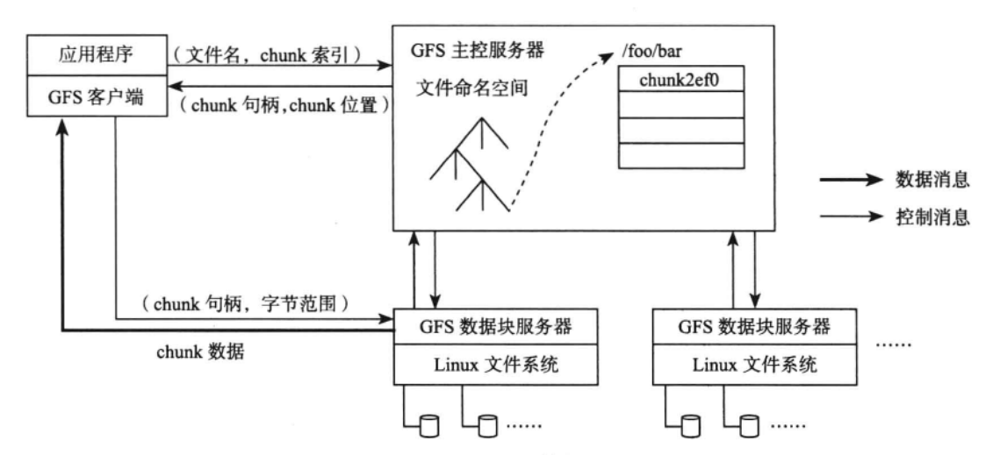
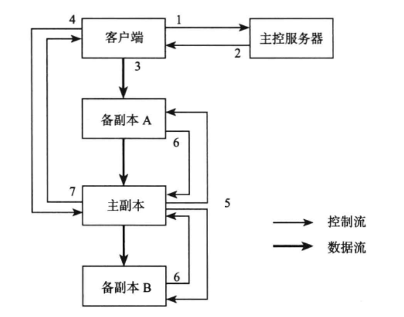

# 第4章 分布式文件系统

*分布式文件系统的主要功能：一是存储文档、图像、视频之类的Blob类型数据；二是作为分布式表格系统的持久化层。*

*分布式文件系统中最为著名的莫过于Google File System（GFS），它构建在廉价的普通PC服务器之上，支持自动容错。GFS内部将大文件划分为大小约为64MB的数据块（chunk），并通过主控服务器（Master）实现元数据管理、副本管理、自动负载均衡等操作。其他文件系统，例如Taobao File System（TFS）、Facebook Haystack或多或少借鉴了GFS的思路，架构上都比较接近。*

## 4.1 Google文件系统

*Google File System是构建在廉价服务器之上的大型分布式系统。他将服务器故障视为正常现象，通过软件的方式自动容错，在保证系统可靠性和可用性的同时，大大降低系统的成本。*

*Google File System是Google分布式存储的基石，其他存储系统，如Google Bigtable、Google Megastore、Google Percolator均直接或间接构建在Google File System上。另外，Google大规模批处理系统MapReduce也需要利用Google File System作为海量数据的输入输出。*

### 4.1.1 系统架构

GFS系统的节点可分为三种角色：GFS Master（主控服务器）、GFS ChunkServer（CS，数据块服务器）以及GFS客户端。

GFS文件被划分为固定大小的数据块（chunk），由主服务器在创建时分配一个64位全局唯一的chunk句柄。CS以普通的Linux文件的形式将chunk存储在磁盘中。为了保证可靠性，chunk在不同的机器中复制多份，默认为三份。

主控服务器中维护了系统的元数据，包括文件及chunk命名空间、文件到chunk之间的映射、chunk位置信息。它也负责整个系统的全局控制，如chunk租约管理、垃圾回收无用chunk、chunk复制等。主控服务器会定期与CS通过心跳方式交换信息。

客户端是GFS提供给应用程序的访问接口，它是一组专用接口，不遵循POSIX规范，以库文件的形式提供。客户端访问GFS时，首先访问主控服务器节点，获取与之进行交互的CS信息，然后直接访问这些CS，完成数据存取工作。

需要注意的是，GFS中的客户端不缓存文件数据，只缓存主控服务器中获取的元数据，这是GFS的应用特点决定的。GFS最主要的应用有两个：MapReduce和Bigtable。对于MapReduce，GFS客户端使用方式为顺序读写，没有缓存文件数据的必要；而Bigtable作为分布式表格系统，内部实现了一套缓存机制。另外，如何维护客户端缓存与实际数据之间的一致性是一个极其复杂的问题。

### 4.1.2 关键问题

1. 租约机制

GFS数据追加以记录为单位每个记录的大小为几十KB到几MB不等，如果每次记录追加都需要请求Master，那么Master显然会成为系统的性能瓶颈，因此，GFS系统中通过租约（lease）机制将chunk写操作授权给ChunkServer。拥有租约授权的Chunkserve称为ChunkServer，其他副本所在的ChunkServer称为备ChunkServer。租约授权针对单个chunk，在租约有效期内，对该chunk的写操作都由主ChunkServer负责，从而减轻Master的负载。一般来说，租约的有效期比较长，比如60秒，只要没有出现异常，主ChunkServer可以不断向Master请求延长租约的有效期直到整个chunk写满。

假设chunk A在GFS中保存了三个副本A1、A2、A3，其中A1是主副本。如果副本A2所在ChunkServer下线后又重新上线，并且在A2下线的过程中，副本A1和A3有更新，那么A2需要被Master当成垃圾回收掉。GFS通过对每一个chunk维护一个版本号来解决，每次给chunk进行租约授权或者主ChunkServer重新延长租约有效期时，Master会将chunk的版本号加1。**A2下线的过程中，副本A1和A3有更新，说明主ChunkServer向Master重新申请租约并增加了A1和A3的版本号，**等到A2重新上线后，Master能够发现A2的版本号太低，从而将A2标记为可删除的chunk，Master的垃圾回收任务会定时检查，并通知ChunkServer将A2回收掉。

2. 一致性模型

GFS主要是为了追加而不是改写设计的。一方面是因为改写的需求比较少，或者可以通过追加实现，比如可以只使用GFS的追加功能构建分布式表格系统Bigtable；另一方面是因为追加的一致性模型相比改写要更加简单有效。

这里只讨论追加的一致性。如果不发生异常，追加成功的记录在GFS的各个副本中是确定并严格一致的；但是如果出现了异常，可能出现某些副本追加成功而某些副本追加不成功的情况，失败的副本可能会出现一些可识别的填充（padding）记录。GFS客户端追加失败将重试，只要返回用户追加成功，说明在所有副本中都至少追加成功了一次。

另外，由于GFS支持多个客户端并发追加，多个客户端之间的顺序是无法保证的，同一个客户端连续追加成功的多个记录也可能被打断，比如客户端先后追加成功记录R1和R2，由于追加R1和R2这两条记录的过程不是原子的，中途可能被其他客户端打断，那么GFS的chunk中记录的R1和R2可能不连续，中间夹杂着其他客户端追加的数据。

GFS的这种一致性模型是追求性能导致的，这增加了应用程序开发的难度。对于MapReduce应用，由于其批处理特性，可以先将数据追加到一个临时文件，在临时文件中维护索引记录每个追加成功的记录的偏移，等到文件关闭时一次性将临时文件改名为最终文件。

3. 追加流程

追加流程是GFS中最为复杂的地方，且高效支持记录追加对基于GFS实现的分布式表格系统Bigtable是至关重要的。大致流程如下：

1）客户端向Master请求chunk每个副本所在的ChunkServer，其中主ChunkServer持有修改租约。如果没有ChunkServer持有租约，说明该chunk最近没有写操作，Master会发起一个任务，按照一定的策略将chunk的租约授权给其中一台ChunkServer。

